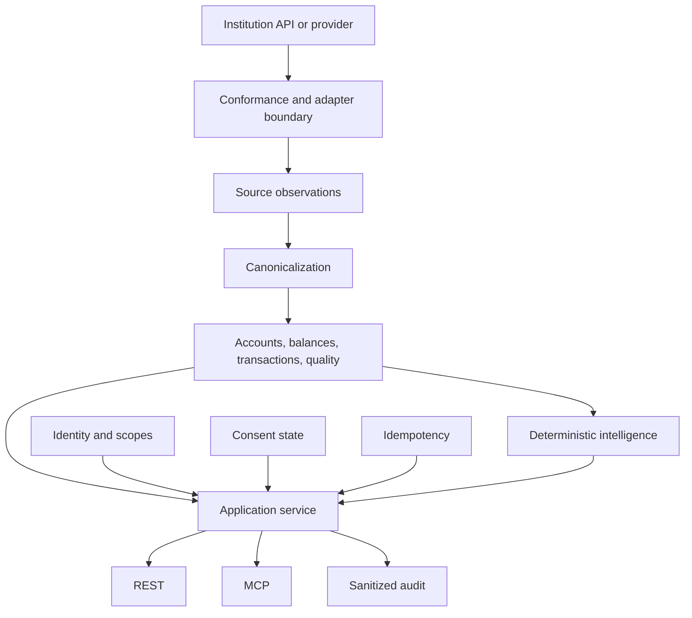

# PIASSES Architecture

## Architectural objective

PIASSES is designed around one domain core with replaceable source providers and multiple delivery interfaces. The architecture treats provider observations, canonical financial records, authorization, consent, and audit as distinct planes.

## System flow

## Domain contracts

The canonical layer avoids inheriting provider-specific assumptions. Important concepts are modeled directly:

- explicit asset and liability positions
- transaction direction independent of provider sign convention
- exact decimal money
- explicit currency
- transaction lifecycle
- source observation identity
- correction lineage
- field-level provenance
- closed missing-value states

## Source observation plane

Source observations retain provider and institution references, connection binding, observation timestamps, opaque source record references, source schema version, and content fingerprints.

Raw provider payloads are not part of the canonical public contract.

## Canonical financial plane

Canonical records are provider-neutral. They preserve enough provenance to explain where financially consequential fields came from and whether the record is direct, normalized, aggregated, or corrected.

Historical corrections supersede prior versions rather than mutating them out of existence.

## Shared application core

All capabilities flow through one service order:

1. resolve workspace-scoped targets
2. construct authorization context
3. evaluate policy
4. execute the capability
5. validate output against the registered schema
6. emit one sanitized audit event

REST and MCP are adapters around that same sequence.

## Persistence

The runnable sandbox uses PostgreSQL-backed repositories for tenancy, credentials, consent, connections, canonical records, idempotency, and audit state. A transactional unit of work keeps business state and success audit evidence aligned.

Migration execution uses checksum verification and an advisory lock so schema history is explicit and concurrent migration attempts do not race.

## Consent and identity

Credentials resolve to organization, workspace, client identity, and a closed scope registry. Secret verification is keyed and timing-safe. The stored credential representation is a verifier, not the bearer secret itself.

Consent is durable product state and is evaluated on protected reads. Revocation does not delete history, but it immediately removes future authority.

## Institution-facing boundary

The project includes a fictional Canadian institution HTTP sandbox and conformance testkit. This allows provider behavior to be tested against a known contract independently of the downstream canonical model.

The architecture is intentionally staged. Conformance and adapter behavior exist before the complete durable source-observation-to-canonical pipeline is declared finished.
