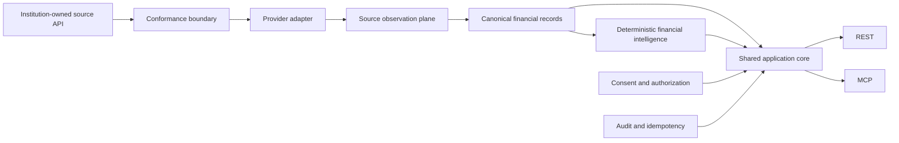

# PIASSES

## Institution-oriented financial data infrastructure

PIASSES is a financial-data infrastructure project for institutions that need to expose, validate, normalize, and govern consumer-authorized financial information without binding downstream developers to one provider's semantics.

The implementation remains private. This case study covers the domain model, consent architecture, provenance strategy, transport design, architectural corrections, and current evidence.

## My role

I own the product direction, financial semantics, architecture constraints, acceptance criteria, and delivery decisions described here. I review implementation across contracts, persistence, REST/MCP behavior, conformance tests, and system evidence. AI-assisted engineering tools are part of the build workflow; technical direction and acceptance remain mine.

**Period:** active development in 2026, with the current institution-facing architecture developed through the summer.  
**Current status:** a locally runnable PostgreSQL-backed sandbox exposes the same canonical capabilities through REST and MCP, with durable tenancy, credentials, consent, idempotency, audit, canonical financial records, deterministic intelligence, and institution API conformance tooling. Live bank ingestion and production identity remain outside the current system boundary.

## Problem

Financial data infrastructure often fails in subtle ways long before an API returns an error. Common examples include interpreting provider sign conventions as economic meaning, treating missing values as zero, losing source provenance during normalization, allowing REST and agent interfaces to drift apart, weakening consent revocation, or rewriting historical corrections without lineage.

PIASSES treats those as contract-design problems rather than integration cleanup.

## Product shape

REST and MCP are sibling interfaces over one application core. Neither transport owns separate business logic.

## Current product surface

The current capability registry contains **12 canonical capabilities** and **12 corresponding client authorization scopes**. The MCP surface includes **six resource templates**, with write operations exposed as explicit tools where idempotency and mutation authority matter.

Both interfaces reach the same journey service for target resolution, authorization, consent, execution, output validation, and sanitized audit behavior.

## Core architecture

### Exact money semantics

Money is represented through canonical decimal strings and explicit currency codes rather than floating-point convenience. Asset and liability position, transaction direction, and economic meaning are modeled directly rather than inferred from a provider's sign convention.

### Six-state absence model

Financially meaningful absence is represented through a closed value-state model:

- present
- missing from source
- unknown
- not applicable
- unsupported by source
- redacted

These states are not interchangeable, and none is silently converted to zero.

### Provenance is part of the record

Canonical records retain source observations and transformation metadata. Financially consequential fields can identify the observations that support them. Correction lineage is explicit, so a corrected transaction does not erase the historical version it superseded.

### Consent changes runtime authority

Consent state is enforced through the shared application service. Revocation through one interface immediately affects equivalent consent-protected reads through the other while preserving the historical audit trail.

### Credential authority fails closed

Persisted scope sets are validated as a whole. An unknown, malformed, case-changed, or whitespace-padded scope invalidates the credential instead of being ignored opportunistically.

Bearer secrets use keyed cryptographic verification and timing-safe comparison. Durable state stores verifiers rather than recoverable plaintext tokens.

### Idempotency is part of the write contract

Writes, including consent revocation, require explicit idempotency. The durable scope includes workspace, capability, principal or credential identity, and validated request shape, so an identical replay returns the same result while a divergent replay fails as a conflict.

## From protocol proof to durable runtime

The first complete developer journey ran against deterministic in-memory sandbox state. That was enough to prove protocol shape, but not restart durability, transactional idempotency, persistent authorization, or exactly-once audit behavior.

The default runnable composition was moved to PostgreSQL. The current server composes persisted repositories, credential resolution, consent, canonical data, audit, and one shared application service beneath both REST and MCP.

The later institution-facing conformance layer exposed a second boundary: source API behavior and provider adaptation could be proven independently, while durable source-observation ingestion into the canonical financial plane remained incomplete. That gap is now explicit in the architecture instead of being hidden behind a generic integration claim.

## Canonical product planes

1. **Identity:** organizations, workspaces, API clients, credentials, scopes.
2. **Control:** sandbox consumers, consents, connections, idempotency.
3. **Financial:** source observations, accounts, balances, transactions, data quality.
4. **Audit:** durable sanitized events.

The separation makes it possible to reason about economic state, authorization state, and explanatory evidence without treating them as one table or one transport concern.

## Institution conformance

The project includes a fictional Canadian institution HTTP sandbox and a closed conformance testkit. The adapter boundary is exercised against deterministic fixtures and can quarantine raw institution payloads before canonicalization.

The institution-to-canonical bridge is not yet complete. The current default runtime still uses deterministic synthetic canonical data rather than end-to-end live bank ingestion.

## Deterministic intelligence

PIASSES contains a deterministic financial-intelligence layer over canonical transaction data, including exact-money summaries, velocity windows, outlier detection, recurring candidates, counterparty rhythm, weekday concentration, and structural exclusions.

It excludes forecasts, confidence scores, recommendations, and LLM-generated financial advice from this layer.

## Technology

- TypeScript
- Node.js 22
- PostgreSQL
- MCP SDK
- REST over HTTP
- Vitest
- ESLint and strict TypeScript contracts
- transactional migrations and repository layers

## Current boundary

PIASSES proves a locally runnable sandbox with persistent financial-data contracts, REST/MCP parity over one core, consent enforcement, credential and scope controls, institution conformance tooling, and deterministic intelligence over synthetic canonical data.

Live institution connectivity, production identity, production deployment, and the completed source-observation-to-canonical bridge remain separate milestones.

[Architecture](ARCHITECTURE.md) · [Technical decisions](TECHNICAL_DECISIONS.md) · [Validation](VALIDATION.md) · [Back to profile](https://github.com/Andy11-cpu)
