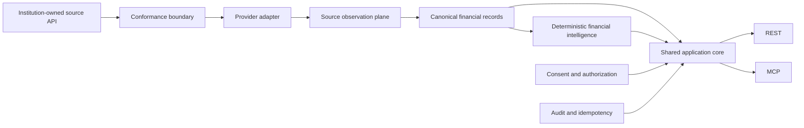

# PIASSES

## Institution-oriented financial data infrastructure

PIASSES is a financial data architecture for institutions that need to expose, validate, normalize, and govern consumer-authorized financial information without binding downstream developers to one provider's semantics.

The private repository contains the product and engineering implementation. This public case study documents the core domain model, consent architecture, provenance strategy, transport design, and validation approach without publishing proprietary source code, credentials, institution-specific secrets, or private operational detail.

## Problem

Financial data infrastructure often fails in subtle ways long before an API returns an error. Common examples include:

- interpreting provider sign conventions as economic meaning
- treating missing values as zero
- losing the source observation that produced a canonical record
- allowing REST and agent interfaces to implement different business rules
- making consent revocation eventually consistent when it should fail closed immediately
- storing bearer credentials in recoverable plaintext
- allowing one unknown persisted scope to coexist with an otherwise valid credential
- changing historical records without preserving correction lineage

PIASSES treats those issues as contract design problems rather than integration cleanup.

## Product shape

The central design choice is that REST and MCP are sibling interfaces over one application core. Neither transport owns separate business logic.

## Core architecture

### Exact money semantics

Money is represented through canonical decimal strings and explicit currency codes rather than floating-point convenience. Asset and liability position, transaction direction, and economic meaning are modeled directly rather than inferred from a provider's sign convention.

### Missing data remains explicit

PIASSES uses a closed value-state model for financially meaningful absence:

- present
- missing from source
- unknown
- not applicable
- unsupported by source
- redacted

Those states are not interchangeable, and none is silently converted to zero.

### Provenance is part of the record

Canonical records retain references to source observations and transformation metadata. Financially consequential fields can identify which observation supports them.

Correction lineage is explicit. A corrected transaction does not erase the historical version it superseded.

### Consent is runtime authority

Consent state is checked through the shared application service. Revocation through one interface immediately affects equivalent consent-protected reads through the other interface.

The architecture preserves the history of what happened while refusing future access that no longer has authority.

### Authorization fails closed

Credentials are resolved to workspace and scope authority. Persisted scope sets are validated as a whole. An unknown or malformed scope invalidates the credential rather than being ignored opportunistically.

Bearer secrets are verified through keyed cryptographic checks. Plaintext credentials are not stored as durable state.

### Idempotency is part of the API contract

Writes, including consent revocation, require explicit idempotency. The persisted scope includes actor identity, workspace, capability, and validated request shape so identical retries can return the same result while divergent payloads are rejected as conflicts.

## Canonical product planes

PIASSES separates several concerns that are often collapsed into one integration layer:

1. **Identity plane** for organizations, workspaces, clients, credentials, and scopes.
2. **Control plane** for consumers, consents, connections, and idempotency.
3. **Financial plane** for source observations, accounts, balances, transactions, and data quality.
4. **Audit plane** for durable sanitized events.

That decomposition makes it easier to reason about which state is economic, which state authorizes access, and which state exists only to explain what occurred.

## Institution conformance

The project includes a fictional Canadian institution HTTP sandbox and a closed conformance testkit. This creates an institution-facing surface where a bank-like API can be tested against expected behavior before live provider integration.

The present institution-to-canonical pipeline is intentionally incomplete. The sandbox proves the adapter and conformance boundary, but the default runnable path still uses deterministic synthetic canonical data rather than claiming live bank connectivity.

## Deterministic intelligence

PIASSES also contains a deterministic financial intelligence layer over canonical transaction data. It supports factual analyses such as exact-money summaries, velocity windows, outlier detection, recurring candidates, counterparty rhythm, weekday concentration, and structural exclusions.

It deliberately does not produce forecasts, confidence scores, recommendations, or LLM-generated financial advice.

## Technology

The private implementation uses:

- TypeScript
- Node.js 22
- PostgreSQL
- MCP SDK
- REST over HTTP
- Vitest
- ESLint and TypeScript strict contracts
- transactional migration and repository layers

## Current boundary

PIASSES is a locally runnable financial-data infrastructure system with PostgreSQL-backed durable state, REST and MCP parity, synthetic sandbox data, provider contracts, conformance tooling, consent enforcement, and deterministic intelligence.

It does not claim live bank connectivity, production authentication, or production deployment. Those boundaries remain explicit in the private product documentation.

## What this case study demonstrates

The project is primarily about preserving financial meaning across institutional boundaries. The difficult work is not making another accounts endpoint. It is deciding what a canonical record means, how its source can be proven, how consent changes authority, and how multiple interfaces can expose one policy without drifting apart.

[Architecture](ARCHITECTURE.md) · [Technical decisions](TECHNICAL_DECISIONS.md) · [Validation](VALIDATION.md) · [Back to profile](https://github.com/Andy11-cpu)
